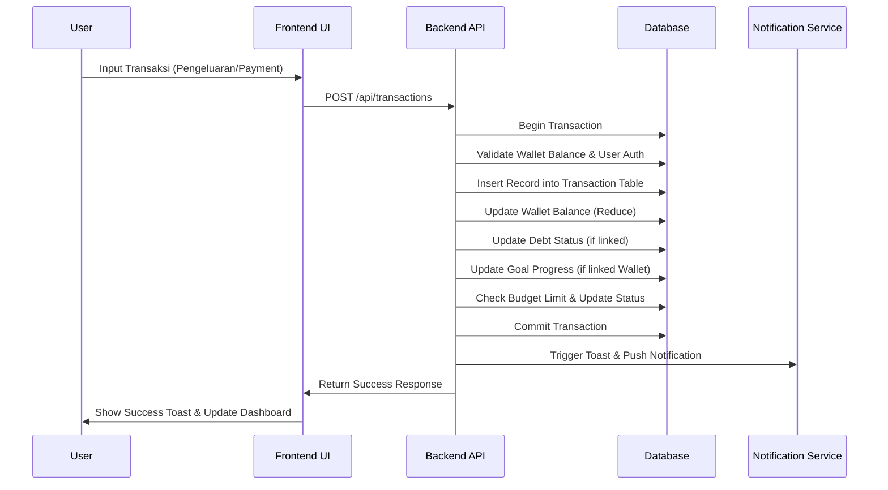
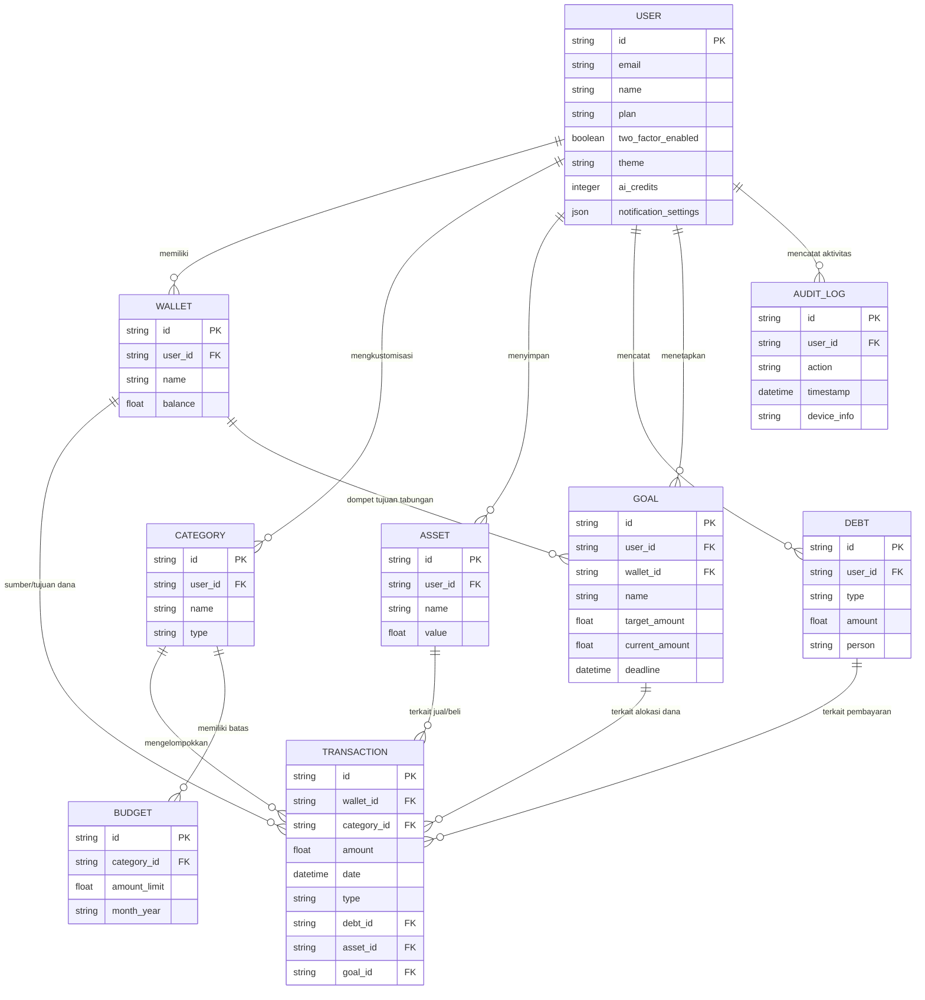

# PRD — Project Requirements Document

## 1. Overview

Aplikasi ini adalah sebuah platform manajemen finansial pribadi berbasis web bernama **fyntra.** yang dirancang untuk masyarakat umum. Seringkali, orang kesulitan melacak pengeluaran, mengatur anggaran (budget), serta memantau aset dan utang mereka karena datanya tersebar di berbagai tempat. Tujuan utama **fyntra.** adalah menyediakan satu tempat terpusat untuk mencatat dan menganalisis kesehatan keuangan pengguna secara manual dengan bantuan insights cerdas. Dengan model bisnis Freemium, pengguna dapat mengakses fitur dasar secara gratis dan meng-upgrade untuk fitur lanjutan (seperti analitik mendalam, jumlah dompet tak terbatas, atau fitur AI). Fokus utama aplikasi ini ada pada kemudahan "Budgeting", pantauan "Investasi/Aset", "Goal Tracking", dan "Laporan Finansial" yang komprehensif serta aman.

## 2. Requirements

**Persyaratan Fungsional:**

- Aplikasi harus dapat diakses melalui browser di semua perangkat (PC, tablet, dan _smartphone_) dengan tampilan yang responsif.
- Pengguna dapat mendaftar, masuk, dan mengelola kredensial mereka (Autentikasi) dengan opsi keamanan tambahan (2FA).
- Pengguna memberikan input data keuangan (transaksi, aset, anggaran, goal) secara manual atau melalui saran AI.
- Terdapat pembatasan fitur berdasarkan status langganan pengguna (Free vs Premium).
- Sistem harus mencatat seluruh aktivitas sensitif pengguna untuk keperluan audit keamanan.
- Transaksi yang terkait dengan utang, aset, atau goal harus secara otomatis memperbarui saldo dompet (wallet) terkait.

**Persyaratan Non-Fungsional:**

- Keamanan dan privasi data pengguna adalah prioritas utama (informasi finansial sangat sensitif).
- Antarmuka pengguna (UI) harus intuitif, bersih, dan tidak membingungkan bagi orang awam (non-akuntan).
- **Antarmuka aplikasi menggunakan layout Dashboard SaaS dengan Sidebar navigasi yang dapat dikolaps (minimized) untuk memaksimalkan ruang kerja serta kenyamanan pengguna di berbagai ukuran layar.**
- Performa aplikasi harus ringan dan cepat saat memuat laporan grafis dan rekomendasi AI.
- Sistem harus memiliki logging aktivitas yang tercatat rapi untuk keamanan akun.
- Konsistensi data harus terjaga saat satu transaksi mempengaruhi multiple entitas (Wallet, Goal, Debt).

## 3. Core Features

- **Landing Page Publik:** Halaman depan statis yang dirancang untuk konversi pengguna sebelum masuk ke aplikasi, terdiri dari:
  - **Navigation:** Menu link (Features, Pricing, FAQ) dan tombol Login/Register.
  - **Hero Section:** Judul persuasif, sub-teks deskriptif, dan tombol Call-to-Action (CTA) utama.
  - **Stats Section:** Menampilkan angka pencapaian (misal: jumlah transaksi terproses, total dana terkelola pengguna).
  - **Interactive Demo:** Preview visual atau video mockup aplikasi fyntra. dalam dashboard SaaS.
  - **Features Highlight:** Kartu informasi yang merinci fitur unggulan (AI, Goals, Security).
  - **Pricing Table:** Perbandingan paket Free vs Premium dengan daftar fitur masing-masing.
  - **FAQ Section:** Jawaban atas pertanyaan umum mengenai keamanan data dan penggunaan.
  - **Footer:** Link sitemap, media sosial, dokumen legal (Privacy Policy/Terms), dan kontak dukungan.
- **Dashboard Terpusat:** Tampilan ringkas mengenai total saldo dari semua dompet, ringkasan arus kas (pemasukan vs pengeluaran bulan ini), dan jalan pintas untuk menambah transaksi baru. **Navigasi utama aplikasi diletakkan pada Sidebar di sebelah kiri untuk akses cepat ke semua modul.**
- **Manajemen Wallet (Dompet):** Fitur untuk membuat beberapa dompet berbeda (seperti rekening bank, dompet digital, uang tunai), lengkap dengan kemampuan transfer antar-dompet.
- **Pencatatan Transaksi:** Pencatatan pemasukan dan pengeluaran secara manual dengan sistem kategorisasi. Transaksi dapat dikaitkan langsung dengan Utang (Debt), Aset (Asset), atau Tabungan (Goal) untuk pelacakan otomatis.
- **Budgeting (Anggaran):** Pengaturan batas pengeluaran bulanan per kategori dengan indikator visual jika pengeluaran sudah mendekati atau melewati batas.
- **Portofolio Aset/Investasi:** Pencatatan nilai aset fisik maupun digital (emas, reksa dana, properti, dll) secara manual. Pembelian atau penjualan aset akan tercatat sebagai transaksi yang mempengaruhi saldo wallet.
- **Analitik & Laporan:** Visualisasi data menggunakan grafik (seperti diagram pie dan grafik garis) untuk melihat tren pengeluaran, rasio tabungan, dan pertumbuhan aset.
- **Manajemen Utang Piutang:** Pencatatan uang yang dipinjam atau dipinjamkan ke pihak lain. Penambahan utang (menerima pinjaman) atau pembayaran utang akan otomatis menciptakan transaksi yang mempengaruhi saldo Wallet terkait.
- **Automasi/Subscription:** Penjadwalan transaksi berulang secara otomatis (seperti tagihan Netflix, internet, atau biaya admin bulanan).
- **Goal Tracking:** Fitur untuk menetapkan target finansial (misalnya: tabungan rumah, dana darurat). Pengguna dapat menetapkan Wallet khusus untuk goal tersebut, sehingga setiap transaksi masuk ke wallet itu akan menghitung progres goal secara otomatis.
- **Smart & AI Features:** Analisis pola pengeluaran untuk memberikan rekomendasi penghematan otomatis, deteksi anomali pada transaksi, dan asisten chat untuk bertanya seputar kondisi keuangan.
- **Reminder System:** Pengingat terjadwal untuk pembayaran tagihan (listrik, internet, kartu kredit) dan pengingat harian untuk mencatat pengeluaran agar data tetap akurat.
- **Security & Audit Logs:** Pencatatan riwayat aktivitas akun (waktu login, perangkat, perubahan data sensitif) dan opsi untuk mengaktifkan Two-Factor Authentication (2FA).
- **Sistem Notifikasi:** Implementasi Toast Notification untuk umpan balik instan setiap kali pengguna melakukan aksi (seperti sukses menambah transaksi atau error saat input) dan Push Notification untuk pengingat tagihan atau batas budget yang hampir habis.
- **Ekspor Laporan:** Kemampuan untuk mengunduh laporan keuangan, ringkasan transaksi, dan rincian aset ke dalam format Excel (.xlsx) atau PDF untuk keperluan arsip atau pelaporan pajak pribadi.
- **Pusat Pengaturan (Settings):** Halaman khusus untuk mengelola Profil (avatar, nama), Tema (pilihan mode terang/gelap), Langganan (upgrade ke Premium/cek riwayat billing), AI Credit (memantau sisa kuota analisis AI), Notifikasi (on/off push dan email), Keamanan (aktivasi 2FA, ganti password), serta informasi **About Fyntra** dan Halaman Bantuan/FAQ.

## 4. User Flow

1. **Akses Landing Page:** Pengguna baru mendarat di fyntra.com untuk melihat nilai proposisi aplikasi sebelum melakukan pendaftaran.
2. **Pendaftaran/Login:** Pengguna mendaftar menggunakan email atau akun sosial media, serta disarankan mengaktifkan 2FA.
3. **Onboarding:** Pengguna diminta membuat _Wallet_ (Dompet) pertama mereka, memasukkan saldo awal, dan menetapkan _Financial Goal_ pertama.
4. **Mulai Mencatat:** Di halaman utama, pengguna mengklik tombol "Tambah Transaksi" untuk mencatat pengeluaran hari ini.
5. **Alokasi Budget:** Pengguna masuk ke menu _Budget_ melalui Sidebar untuk menetapkan batas jajan kopi dan transportasi bulan ini.
6. **Pemantauan & AI:** Setiap akhir pekan/bulan, pengguna masuk ke menu _Analytics_ untuk melihat laporan, berkonsultasi dengan asisten AI untuk tips penghematan, dan meng-update nilai _Asset_ mereka.
7. **Reminder & Notifikasi:** Pengguna menerima notifikasi pengingat tagihan atau pengingat untuk mencatat transaksi yang terlewat.
8. **Upgrade:** Saat butuh analitik pro, wallet > 3, atau fitur AI canggih, pengguna ditawarkan langganan ke versi Premium.
9. **Manajemen Akun & Kustomisasi:** Pengguna masuk ke menu Settings melalui Sidebar untuk menyesuaikan tampilan aplikasi (tema), mengelola keamanan akun, melihat sisa kuota AI, serta melakukan logout.

## 5. Architecture

Aplikasi ini akan dibangun secara _Fullstack_ di mana tampilan antarmuka (Frontend) dan logika server (Backend) dijalankan dalam satu kerangka kerja yang sama. Klien (browser pengguna) akan berkomunikasi langsung dengan server untuk meminta atau mengirim data, yang kemudian akan memvalidasi autentikasi, menyimpan log audit, dan menyimpan atau mengambil data dari database relasional. Layanan eksternal akan digunakan untuk fungsi AI dan penjadwalan tugas (cron jobs).

```mermaid
graph TD
    User([Pengguna Umum]) -->|Input/Akses Web| UI[Frontend UI<br/>(SaaS Layout + Sidebar)]
    UI -->|Kirim Request API| API[Backend API Layer]
    API -->|Cek Sesi Login| Auth[Authentication Service]
    API -->|Read/Write Data| ORM[Proses Data / ORM]
    ORM -->|Kueri Database| DB[(Database Relasional)]
    API -->|Log Activity| Audit[Audit Log Service]
    API -->|Request Insight| AI[AI Service / LLM]
    Scheduler[Cron Job Service] -->|Trigger Reminder| API

    subgraph Frontend Structure
    UI --- Sidebar[Navigasi Sidebar<br/>(Collapsible)]
    UI --- MainContent[Konten Utama<br/>(Dashboard, Forms, Charts)]
    end

    style User fill:#f9f,stroke:#333,stroke-width:2px
    style DB fill:#bbf,stroke:#333,stroke-width:2px
    style AI fill:#ffd966,stroke:#333,stroke-width:2px
    style Sidebar fill:#e1f5fe,stroke:#333,stroke-width:1px
    style MainContent fill:#e1f5fe,stroke:#333,stroke-width:1px
```

### Sequence Diagram

Diagram berikut menggambarkan alur sistem saat pengguna mencatat transaksi pengeluaran yang juga berkontribusi pada pelunasan utang dan progres goal.



## 6. Database Schema

Sistem ini menggunakan struktur database relasional untuk menyimpan histori finansial pengguna serta log keamanan. Skema telah diperbarui untuk mendukung relasi lintas fitur (Transaction linked to Debt, Asset, Goal).

**Tabel dan Kolom Utama:**

1. **User:** Menyimpan profil dan status langganan pengguna.
   - `id` (String/UUID): ID unik pengguna.
   - `email` (String): Alamat email, untuk login.
   - `name` (String): Nama pengguna.
   - `plan` (String): Status akun ("free" atau "premium").
   - `two_factor_enabled` (Boolean): Status aktifasi 2FA.
   - `theme` (String): Preferensi tema ("light", "dark", "system").
   - `ai_credits` (Integer): Sisa kuota penggunaan fitur AI.
   - `notification_settings` (JSON/Object): Konfigurasi preferensi notifikasi pengguna.
2. **Wallet:** Akun sumber dana pengguna.
   - `id` (String/UUID): ID unik dompet.
   - `user_id` (FK): Relasi ke tabel User.
   - `name` (String): Nama dompet (misal: "BCA Gaji").
   - `balance` (Float): Saldo saat ini.
3. **Category:** Daftar kategori pengeluaran/pemasukan.
   - `id` (String/UUID): ID unik kategori.
   - `user_id` (FK): Relasi ke tabel User.
   - `name` (String): Nama kategori (misal: "Makanan", "Gaji").
   - `type` (String): Tipe ("income" atau "expense").
4. **Transaction:** Catatan aliran uang (Pusat penghubung untuk Debt, Asset, Goal).
   - `id` (String/UUID): ID transaksi.
   - `wallet_id` (FK): Relasi ke tabel Wallet (sumber/tujuan dana).
   - `category_id` (FK): Relasi ke tabel Category.
   - `amount` (Float): Jumlah nominal.
   - `date` (DateTime): Tanggal transaksi.
   - `type` (String): "income", "expense", atau "transfer".
   - `notes` (String): Catatan opsional.
   - `debt_id` (FK, Nullable): Relasi ke tabel Debt (jika transaksi ini adalah pembayaran/tambah utang).
   - `asset_id` (FK, Nullable): Relasi ke tabel Asset (jika transaksi ini adalah pembelian/penjualan aset).
   - `goal_id` (FK, Nullable): Relasi ke tabel Goal (jika transaksi ini dialokasikan untuk goal tertentu).
5. **Budget:** Target pengeluaran bulanan per kategori.
   - `id` (String/UUID): ID budget.
   - `category_id` (FK): Relasi ke tabel Category.
   - `amount_limit` (Float): Batas maksimal pengeluaran.
   - `month_year` (String): Periode bulan dan tahun.
6. **Asset:** Catatan investasi atau barang berharga.
   - `id` (String/UUID): ID aset.
   - `user_id` (FK): Relasi ke tabel User.
   - `name` (String): Nama aset (misal: "Reksadana A").
   - `value` (Float): Nilai aset saat ini.
7. **Debt:** Catatan utang atau piutang.
   - `id` (String/UUID): ID utang/piutang.
   - `user_id` (FK): Relasi ke tabel User.
   - `type` (String): "payable" (utang) atau "receivable" (piutang).
   - `amount` (Float): Jumlah sisa utang.
   - `person` (String): Nama peminjam/yang berutang.
8. **Goal:** Target finansial jangka panjang pengguna.
   - `id` (String/UUID): ID unik goal.
   - `user_id` (FK): Relasi ke tabel User.
   - `wallet_id` (FK): Relasi ke tabel Wallet (dompet khusus untuk menabung goal ini).
   - `name` (String): Nama goal (misal: "Rumah Impian").
   - `target_amount` (Float): Target nominal yang ingin dicapai.
   - `current_amount` (Float): Jumlah terkumpul saat ini (bisa dihitung dari saldo wallet terkait).
   - `deadline` (DateTime): Tanggal target pencapaian.
9. **AuditLog:** Riwayat aktivitas keamanan dan sistem.
   - `id` (String/UUID): ID unik log.
   - `user_id` (FK): Relasi ke tabel User.
   - `action` (String): Deskripsi aksi (misal: "LOGIN", "UPDATE_TRANSACTION").
   - `timestamp` (DateTime): Waktu kejadian.
   - `device_info` (String): Informasi perangkat/IP pengguna.

**Diagram Entitas Relasi (ERD):**



## 7. Tech Stack

Mengingat aplikasi web ini membutuhkan kecepatan pengembangan, desain yang modern, keamanan yang ketat, serta efisiensi untuk menekan biaya awal, berikut adalah tumpukan teknologi (tech stack) yang direkomendasikan:

Frontend & Backend (Full-stack Framework): Next.js. Sangat bagus untuk membangun antarmuka web yang cepat dan menangani logika sisi server (API) di dalam satu tempat.
Styling (Desain Tampilan): Tailwind CSS. Memungkinkan pembuatan desain yang rapi, responsive untuk web dan HP dengan sangat cepat.
UI Komponen: shadcn/ui. Katalog komponen siap pakai (tombol, formulir, modal, Sidebar, Navigation Menu) yang cantik dan bersih. Sangat cocok untuk dashboard finansial berbasis SaaS yang dapat dikolaps.
Animasi & Interaksi: Framer Motion. Untuk animasi halus pada Hero section dan efek scroll reveal di elemen Landing Page.
Ikon: Lucide React. Koleksi ikon modern dan konsisten untuk menu Settings dan navigasi.
Database Relasional: Supabase (PostgreSQL). Database PostgreSQL yang dikelola (managed) dengan skalabilitas tinggi, dilengkapi dashboard, backup, dan kemudahan integrasi tanpa perlu mengelola server database secara manual.
Storage (Penyimpanan File): Supabase Storage. Digunakan untuk menyimpan file seperti lampiran transaksi, dokumen, atau aset pengguna secara aman dan scalable.
ORM (Penghubung Kode & Database): Drizzle ORM. Alat modern yang efisien dan type-safe untuk melakukan operasi baca/tulis database serta mengelola migrasi schema.
Autentikasi (Sistem Login): Better Auth. Mengelola login, pembuatan akun, dan penjagaan sesi secara modern dan aman (mendukung fitur seperti 2FA).
Deployment (Hosting): Aplikasi ini paling cocok di-hosting di Vercel, yang sangat optimal untuk ekosistem Next.js dan mendukung skalabilitas aplikasi.
Library Notifikasi: Sonner atau React Hot Toast (untuk Toast) dan integrasi Web Push API untuk notifikasi real-time ke pengguna.
Library Ekspor Data: ExcelJS (untuk Excel) dan React-pdf atau jspdf (untuk PDF).
AI & Smart Features: Vercel AI SDK atau OpenAI API. Digunakan untuk analisis pola pengeluaran, deteksi anomali, dan fitur asisten keuangan berbasis AI.
Task Scheduling: Trigger.dev. Digunakan untuk manajemen sistem reminder terjadwal (tagihan, input harian) dan proses background lainnya, lebih cocok untuk environment serverless dibanding node-cron.
